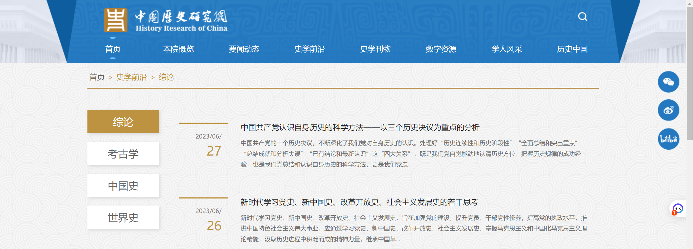
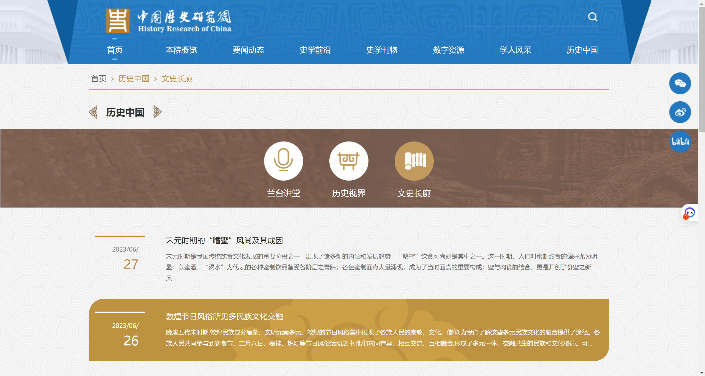

<!-- TOC -->
  * [爬虫模块化代码](#)
    * [](#)
  * [一、官网类](#)
    * [1.1 中国历史研究院 http://hrczh.cass.cn/](#11--httphrczhcasscn)
<!-- TOC -->

| 序号 | 网站名    | 链接  | 解密  | 最新更细时间   | 
|----|--------|-----|-----|----------|
| 1.1 | 中国历史研究院 | http://hrczh.cass.cn/ | 无   | 2023/7/4 |
|    |        |     |     ||
|    |        |     |     ||
|    |        |     |     ||

# 一、代码部分
## （一）爬虫模块化代码
### 1.1 进行请求的代码
```python
import chardet as chardet
import requests
import json
from lxml import etree

from requests.adapters import HTTPAdapter
from urllib3.util.retry import Retry

# 用于解决最大连接的问题
session = requests.Session()
retry = Retry(connect=3, backoff_factor=0.5)
adapter = HTTPAdapter(max_retries=retry)
session.mount('http://', adapter)
session.mount('https://', adapter)

header = {
    'User-Agent':'Mozilla/5.0 (Windows NT 10.0; Win64; x64) AppleWebKit/537.36 (KHTML, like Gecko) Chrome/113.0.0.0 Safari/537.36',
}
def getResponse(req_url):
    response = session.get(req_url,headers=header)
    # 解决中文乱码：获得网页编码，并将其设置为获取数据的编码
    encoding = chardet.detect(response.content)['encoding']
    response.encoding = encoding
    # type(responseText) : str
    responseText = response.text        
    try:
        responseJson = json.loads(responseText)
        return responseText,responseJson
    except json.JSONDecodeError:
        responseTree = etree.HTML(responseText)
        return responseText,responseTree
```
## （二）常见报错
1. 问题报错：``UnicodeDecodeError: 'utf-8' codec can't decode byte 0xe2 in position 10: invalid continuation byte``
   2. json无法解析response.content非utf-8的字符

- 如果网页为请求PDF并将其内容写入，则使用response.content,否则会乱码或空白页面
```
response = requests.get(pdfUrl, headers=pdfheader)
print(response.content)
with open('test.pdf','wb') as wf:
    wf.write(response.content)
```
TODO：response.text和response.content的区别

# 二、网页部分
## （一）官网类
### 1.1 中国历史研究院 http://hrczh.cass.cn/
1. 【史学前沿】/【总论】【考古学】【中国史】【世界史】

2. 【历史中国】/【文化长廊】

